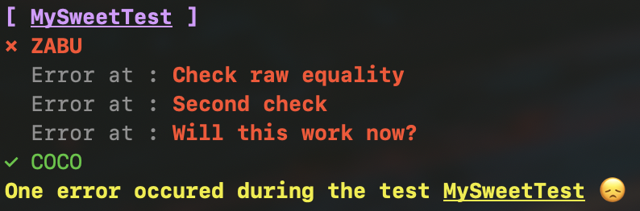

*FAst and smaRT TESTing*

.. for those who want to enjoy simple and colorful tests without having to learn the whole ecosystem of a rich test library.



FarTest is an obvious, colorful and enjoyable test library for small applications. It does not do cool stuff like code coverage, but you'll learn to use in no time.

## Installation

```
npm install --save-dev fartest
```

## Usage
FarTest simplest API export three functions :

- `start(test: Function)` - start a new test,
- `stage(name: string)` - define the current stage inside a test,
- `test(condition: boolean, name?: string)` - check an assertion inside a test. If `condition` is `true` then the assertion has succeeded, otherwise it failed. 
- `same(a: any, b: any, name?: string)` - check if two values are the same. When `a` and `b`are objects, execute a deep comparison. Values can be of any type : numbers, strings, arrays, maps, sets, ...

And that's all. 

First, let's import the functions we need :
```javascript
import { start, stage, test } from 'fartest'
```

Then, we start the test :
```javascript
// the name of the function (MyAwesomeTest) is the name of the test
// and is optional
start(async function MyAwesomeTest() {

  // we define the current stage of our test
  stage('Some succesful tests')
    // simple assertion
    test(1 == "1")

    // the test description will be displayed in case of error
    test(21 == "21", "Test description")

  stage('A simple test which will not succeed')
    test(21 === "21", "Test description")  // will fail because types don't match
    same(21, "21", "Test description")  // will fail as well

  stage('Comparing objects')
    same({x: 1, y: 2}, {x: 1, y: 2})  // will pass

  stage('Comparing object and array')
    same(['foo'], {0: 'foo'})  // will not pass

  stage('Crash test')
    undefined.coco = 321321  // any invalid code will be caught
})
```

### Test asynchronous functions

Because your main test functions is declared as `async` you can just use `await` anywhere you need it.


## Running multiple tests
You can run multiple tests at once, in which case they will be executed one after another :
```javascript
// test 1
start(async function CoolTest() {
  stage('1 == 1')
    test(1 == 1)  // ok, pass

  stage('2 == "2"')
    test(2 == "2")  // also pass because non-strict equality

  stage('same(2, "2")')
    same(2, "2")  // does not pass
})

// test 2
start(async function SuperCoolTest() {
  stage('3 == 3')
    test(3 == 3)
})
```

### Conclusion
Congratulations! You've learned a new test library in less that 5 minutes!

What you waiting for?

*Let's FarT!*
